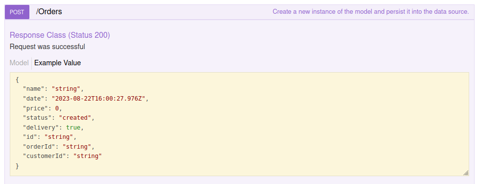

# Design Docs for Eatery app

## basic info
This app is build using the loopback 3 framework.  
Althought loopack 3 is depracated.  
___
## Models
1. customer     (user)
2. order        (service)
3. chef         (employee)
___
## Model relatsions
1. an order Belongs to one Customer
2. an Order has many Chefs
3. a Customer has many orders
4. a Chef Has one Order
___
## Access control rules (ACL)
- Anyone can register as a Customer; then log in and log out.
- Logged-in Customers can create new Orders.
- Logged-in Chefs can Edit new Orders.
___
## Model definiations

### Order
| Property name| Property type | required? |
| -- | -- | -- |
| name | string | true |
| date | date | true |
| price | number | true |
| status | string | true |
| delivery | boolean | false |

### Customer
Customer inherits from User model

| Property name| Property type | required? |
| -- | -- | -- |
| name | string | true |
| phone | string | true |
| city | string | false |

### Chef
Customer inherits from User model

| Property name| Property type | required? |
| -- | -- | -- |
| name | string | true |
| busy | boolean | true |

___
## Development steps
1. create the app using `lb` command.
2. create the models using `lb model` command.
3. identify models' relations using `lb relation` command.
4. add presistent datasource using `lb datasource` command.
5. edit the `model-config.json` file with the added data source.
___
## side nots if issues happened
1. I removed the foreign keys `"foreignKey": "orderId"` from `customer.json` and `chef.json` because the issue seen below happens when I add them.

_____
## Resources I used durin the build of the app
1. [How to install MongoDB community server on Ubuntu](https://www.mongodb.com/docs/manual/tutorial/install-mongodb-on-ubuntu/)
2. faced an issue so I used [Troubleshooting installation errors in mongodb](https://www.mongodb.com/docs/manual/reference/installation-ubuntu-community-troubleshooting/#std-label-install-ubuntu-troubleshooting)
3. [Solution](https://www.mongodb.com/community/forums/t/getting-error-while-updating-mongodb-from-6-to-7-in-ubuntu-22-04/239822)
4. [MongoDB enable authentication](https://www.mongodb.com/docs/v3.4/tutorial/enable-authentication/)

## Important notes
1. make all connection strings as `env variables` in docker-compose
2. don't create a connection object in rabbitmq every time a notification get sent **DONE**
3. **need confirmation** make the auth tokens customer to put whatever property you want in it
4. search why it returns 401
5. add the read for chef **DONE**
6. send the data of notification as if you would using an email
7. search how to customize monstache replication process
8. seperate the notificaiton logic
9. try to stop rabbitmq and check if other services will be functioning .. try searching for conn.onclose()